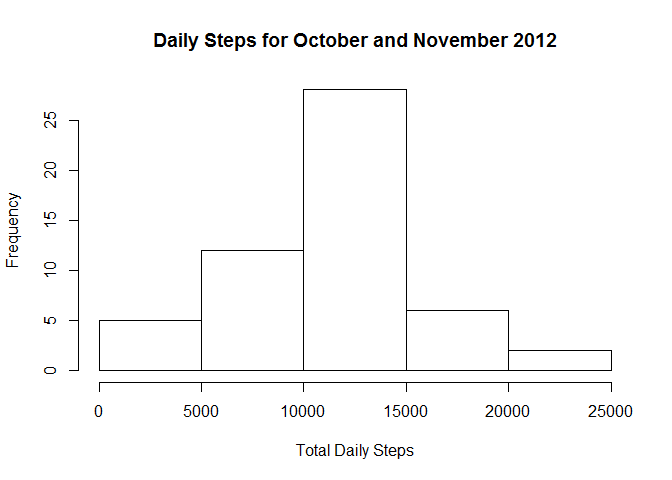
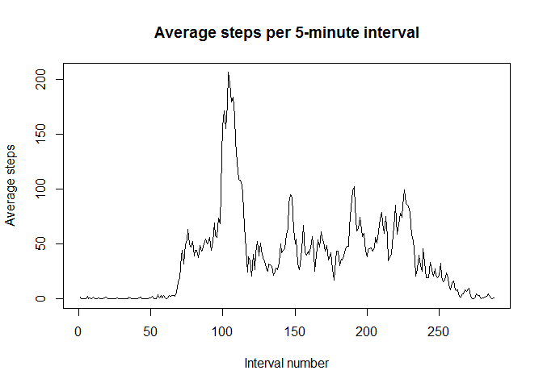
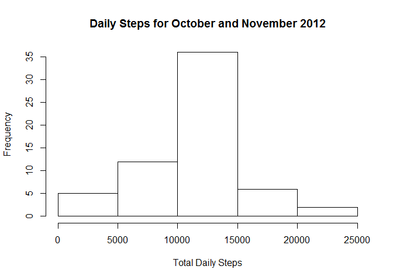
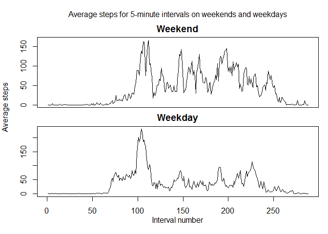

# Daily Step Analysis
Janelle Curtis  
July 5, 2016  

## Loading and preprocessing the data

First, we read in the data

```r
activitydata <- read.csv("activity.csv")
```

Next, we want to calculate the total number of steps per day.  As some days don't
have any steps tracked, we must filter out all NA values first.

```r
filtdata <- activitydata[!is.na(activitydata$steps),]
totalsteps <- with(filtdata, tapply(steps, date, sum))
```

## What is mean total number of steps taken per day?

Finally, we plot these totals as a histogram.

```r
hist(totalsteps, xlab = "Total Daily Steps", main = "Daily Steps for October and November 2012")
```

<!-- -->

Additionally, we want to calculate the mean and median steps taken.

```r
avgsteps <- format(mean(totalsteps, na.rm = TRUE), scientific = FALSE)
medsteps <- median(totalsteps, na.rm = TRUE)
```

The mean number of steps taken daily is 10766.19 and the median number of 
steps taken daily is 10765.

## What is the average daily activity pattern?

To look at the daily activity pattern, we first calculate the mean
number of steps for each 5-minute interval, again ignoring NA values,
and then plot the values as a time series.

```r
avgstepsint <- with(activitydata, tapply(steps, interval, mean, na.rm = TRUE))
plot(avgstepsint, type = "l", xlab = "Interval number", ylab = "Average steps", 
     main = "Average steps per 5-minute interval")
```

<!-- -->

We also want to know the 5-minute interval with the largest average steps across
all days.

```r
maxint <- match(max(avgstepsint), avgstepsint)
maxtime <- names(avgstepsint)[maxint]
```

The interval with the largest average steps across all days is 104 which
corresponds to the 5-minute interval starting at 835.


## Imputing missing values

To more closely examine the missing values in the dataset, we calculate the
number of rows with missing step values (NA).

```r
numna <- sum(is.na(activitydata$steps))
```

The total number of rows with a missing step value is 2304.

We now replace all the NA values with the mean of their 5-minute interval.

```r
library(plyr)
```

```
## Warning: package 'plyr' was built under R version 3.2.5
```

```r
meandata <- function(df){
    df$steps[is.na(df$steps)] <- mean(df$steps, na.rm = TRUE)
    return(df)
}
activitydataimp <- ddply(activitydata, .(interval), meandata)
```

We now compare our earlier histogram of total steps per day to a new histogram
of total steps per day using the imputed data.

```r
totalstepsimp <- with(activitydataimp, tapply(steps, date, sum))
hist(totalstepsimp, xlab = "Total Daily Steps", main = "Daily Steps for October and November 2012")
```

<!-- -->

We also compare our mean and median steps per day after imputing the NA values.

```r
avgstepsimp <- format(mean(totalstepsimp), scientific = FALSE)
medstepsimp <- median(totalstepsimp)
```

The original mean steps per day was 10766.19 while the new mean steps per day is 10766.19.
The original median steps per day was 10765 while the new median steps per day is 1.0766189\times 10^{4}.

## Are there differences in activity patterns between weekdays and weekends?

Finally, we want to look at the how the activity level changes on weekdays and weekends.
First, we transform the date variable to the date class, and then add a factor variable
to the data frame with the value either "weekday" or "weekend".

```r
datawdate <- activitydataimp
datawdate$date <- as.Date(datawdate$date, format = "%Y-%m-%d")
datawdate$wkday <- weekdays(datawdate$date)
datawdate$daystatus <- ifelse(datawdate$wkday == "Saturday" | datawdate$wkday == "Sunday", 
                              "Weekend", "Weekday")
```

The weekday and weekend data is separated.

```r
wkdaydata <- datawdate[datawdate$daystatus == "Weekday",]
wkenddata <- datawdate[datawdate$daystatus == "Weekend",]
```

We calculate the average steps for each 5-minute interval for the weekdays and weekends.

```r
avgstepswkday <- with(wkdaydata, tapply(steps, interval, mean, na.rm = TRUE))
avgstepswkend <- with(wkenddata, tapply(steps, interval, mean, na.rm = TRUE))
```

Lastly, we make a panel plot for the average steps during each 5-minute interval for 
the weekdays and the weekends.

```r
par(mfrow = c(2,1))
par(mar = c(0,0,2,0))
par(oma = c(4,4,2,1))
plot(avgstepswkend, type = "l", xaxt = "n", main = "Weekend")
plot(avgstepswkday, type = "l", main = "Weekday")
mtext("Interval number", side = 1, outer = TRUE, line = 2)
mtext("Average steps", side = 2, outer = TRUE, line = 3)
mtext("Average steps for 5-minute intervals on weekends and weekdays", side = 3, outer = TRUE)
```

<!-- -->
